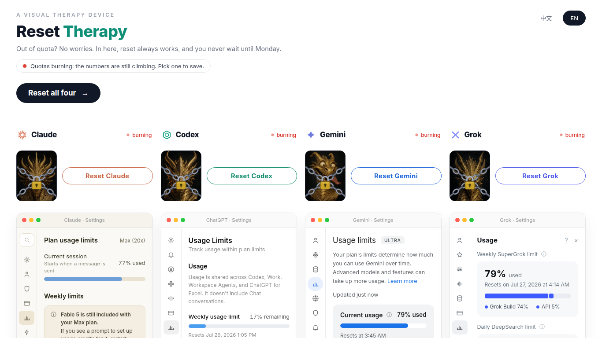

# Reset Therapy 重置 Therapy

A visual therapy device for people who live inside AI quota limits.

Four painstakingly faked usage panels - ChatGPT / Codex, Claude, Gemini, Grok - sit there burning your quota in real time. The numbers climb. The reset day never comes. Here, you do not wait until Monday: you press the button, the chained golden dragon breaks free, the bars refill, world peace.

Live page: <https://www.ted-h.com/reset-therapy> (中文版: <https://www.ted-h.com/zh_TW/reset-therapy>)



## What it does

- 1:1 mock settings panels of the four providers, with quotas burning live while you watch
- One reset button per provider, plus a big "Reset all four" - reset always works here, unlike real life
- Four golden dragons in chains; healing a provider snaps the chains and the dragon celebrates in comic-bubble style
- A weekly "who got healed the most" leaderboard; columns re-order by rank
- Fake-but-deterministic baseline numbers (same on every device) plus real global click counts from an optional tiny API
- Your personal heal count is kept in localStorage
- Bilingual: English and 台灣正體, with a language switcher
- Zero build step, zero dependencies: one self-contained `index.html` (art baked in as data URIs, fonts from Google Fonts)

## Run it

Open `index.html` in a browser. That is the whole app.

Any static host works (GitHub Pages included). Language: `?lang=zh` / `?lang=en`, or the switcher in the top-right corner.

Without a backend the page still fully works - it just falls back to the deterministic baseline plus your own local counts.

## Optional backend: shared global counters

So every visitor sees the same "how many times humanity healed Claude this week" numbers, the page calls two endpoints (and degrades gracefully if they are absent):

```
GET  /reset-therapy/api/stats
     -> {"weekIdx": N,
         "week": {"claude": 0, "codex": 0, "gemini": 0, "grok": 0},
         "all":  {"claude": 0, "codex": 0, "gemini": 0, "grok": 0}}

POST /reset-therapy/api/heal
     {"providers": ["claude", "gemini"]}
     -> fresh stats payload (each listed provider +1 this week)
```

`server/reset_therapy_stats/` is the reference implementation used in production: an Odoo 19 module storing counters in a single sqlite file (one row per provider-week, Monday-start weeks fixed to Asia/Taipei). Any 50-line server in any framework can implement the same contract.

## Art pipeline

The dragons are gpt-image-2 output, post-processed to 600x750 webp and inlined:

```
cd art
OPENAI_API_KEY=sk-... python3 gen_dragons.py   # 4 PNGs into art/out/
python3 drg_post.py                            # crop, webp, inject into index.html
```

`drg_post.py` needs Pillow, and a template with `__DRG_*__` placeholder tokens (the shipped `index.html` already has the art baked in).

## Disclaimer

This is a parody toy. The provider panels imitate the look of real products for the joke; the project is not affiliated with OpenAI, Anthropic, Google, or xAI. All quota numbers are theatre: a deterministic fake baseline plus real button presses from visitors. No real accounts are read, and pressing reset here sadly does not reset anything real.

## License

MIT for the page and scripts (see `LICENSE`). The optional Odoo module under `server/` is LGPL-3, per Odoo convention (stated in its manifest).

---

# 中文說明

給活在 AI 額度上限裡的人的視覺化療癒裝置。

四個精心仿造的用量面板 - ChatGPT / Codex、Claude、Gemini、Grok - 就在你眼前即時燃燒額度。數字一直爬, 重置日永遠等不到。在這裡不用等星期一: 按下按鈕, 被鎖鏈綁住的黃金龍掙脫, 額度條回滿, 世界和平。

線上版: <https://www.ted-h.com/zh_TW/reset-therapy>

## 功能

- 四家的 1:1 仿真設定面板, 額度即時燃燒
- 每家一顆重置鈕, 加一顆「全部重置吧」- 在這裡重置永遠有效, 跟現實不一樣
- 四條被鎖鏈綁住的黃金龍; 治癒後鎖鏈斷裂, 龍用漫畫對話框慶祝
- 每週「誰被治癒最多次」排行榜, 欄位照名次排序
- 假但確定性的基準數字 (每台裝置看到的都一樣), 加上選配 API 的真實全球點擊數
- 你自己的治癒次數存在 localStorage
- 雙語: English 與台灣正體, 右上角可切換
- 零建置、零依賴: 一個自包含的 `index.html` (美術以 data URI 內嵌, 字型來自 Google Fonts)

## 執行

用瀏覽器打開 `index.html` 就是全部了。任何靜態主機都能放 (含 GitHub Pages)。語言用 `?lang=zh` / `?lang=en` 或右上角切換器。

沒有後端也完全能玩 - 只是退回確定性基準值加你本機的個人次數。

## 選配後端: 全球共用計數

為了讓每個訪客看到同一份「本週人類治癒了 Claude 幾次」, 頁面會呼叫上面列的兩個端點, 拿不到就自動降級。`server/reset_therapy_stats/` 是正式站用的參考實作: Odoo 19 模組, 計數存在一個 sqlite 檔 (每個 provider-週一列, 週一起算、固定台北時區)。用任何框架寫 50 行也能實作同樣的合約。

## 免責聲明

這是惡搞玩具。面板外觀是為了笑點而模仿真實產品, 專案與 OpenAI、Anthropic、Google、xAI 皆無關。所有額度數字都是演出來的: 確定性的假基準加訪客真實按鈕次數。不讀任何真實帳號, 在這裡按重置也很遺憾地不會重置任何真實額度。
